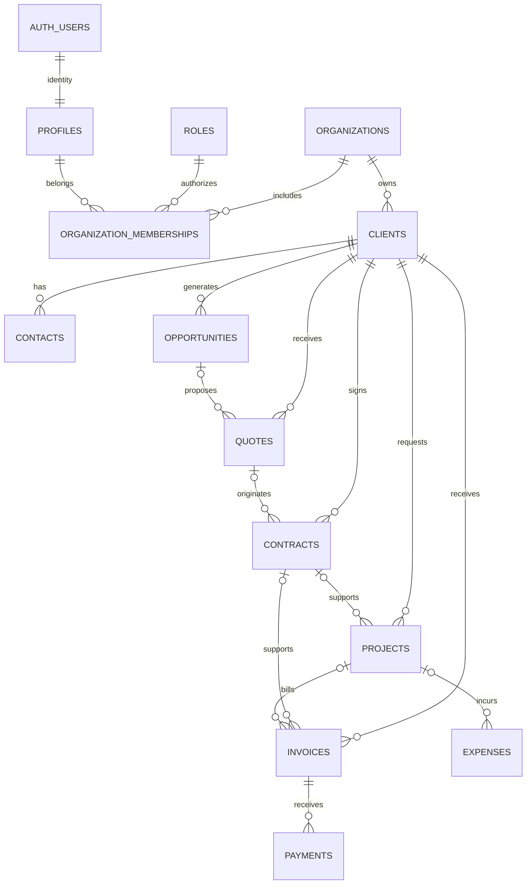

# Modelo de datos v1

El modelo separa identidad de Supabase Auth, autorización por empresa y operación comercial/financiera. Las tablas usan nombres en inglés; la interfaz permanece en español. No contiene usuarios, clientes ni movimientos de ejemplo. Solo se inserta el catálogo de cuatro roles, que es configuración de seguridad.

## Entidades

| Tabla                      | Responsabilidad y relaciones                                                                                                                                                               |
| -------------------------- | ------------------------------------------------------------------------------------------------------------------------------------------------------------------------------------------ |
| `auth.users`               | Identidad gestionada por Supabase Auth. No se crea en las migraciones ni se duplican contraseñas.                                                                                          |
| `profiles`                 | Perfil de cada identidad; PK/FK `id → auth.users.id`. Un trigger crea el perfil vacío tras un alta legítima de Auth. Se incorporan perfiles de identidades reales preexistentes al migrar. |
| `roles`                    | Catálogo inmutable desde el cliente: admin, manager, accountant, viewer.                                                                                                                   |
| `organizations`            | Empresa y moneda de trabajo; primera versión limitada a COP.                                                                                                                               |
| `organization_memberships` | Relación usuario/empresa con un rol. PK `(organization_id, user_id)`. Una persona puede pertenecer a varias empresas.                                                                      |
| `clients`                  | Datos comerciales y documento opcional, único por tipo/número dentro de la empresa.                                                                                                        |
| `contacts`                 | Personas de contacto de un cliente.                                                                                                                                                        |
| `opportunities`            | Oportunidad vinculada a cliente y, opcionalmente, contacto del mismo cliente.                                                                                                              |
| `quotes`                   | Cotización numerada por empresa, cliente y oportunidad opcional.                                                                                                                           |
| `contracts`                | Contrato numerado por empresa, cliente y cotización opcional.                                                                                                                              |
| `projects`                 | Proyecto de un cliente, con contrato opcional.                                                                                                                                             |
| `invoices`                 | Registro administrativo de factura, cliente, proyecto/contrato opcionales y vencimiento. No es facturación electrónica.                                                                    |
| `payments`                 | Pago de una factura de la misma empresa. Referencia externa opcional única por empresa para reducir duplicados.                                                                            |
| `expenses`                 | Gasto con proveedor, categoría, soporte/referencia opcional y proyecto opcional.                                                                                                           |

Todas las tablas operativas tienen UUID, `organization_id` obligatorio, autor de creación/última actualización y marcas de tiempo. Los autores son identidades de `profiles`. Los triggers fijan autores desde `auth.uid()`, protegen `id`, empresa y fecha/autor originales, y actualizan las marcas de modificación. No constituyen un historial de auditoría completo.

## Integridad

Las FK entre registros empresariales son compuestas con `organization_id`; un UUID válido de otra empresa no sirve para establecer una relación. Cuando existe `client_id`, las referencias opcionales incluyen también el cliente: una cotización no puede usar una oportunidad de otro cliente. Las claves compuestas de destino tienen restricciones UNIQUE e índices de soporte.

La eliminación de registros referenciados usa RESTRICT. Tampoco se permite eliminar una identidad Auth que aún tenga membresías o referencias de autor: debe diseñarse el procedimiento de retención/anonimización antes de habilitar bajas. Nunca borrar en cascada documentos financieros para eliminar un usuario.

Los importes usan `numeric(18,2)`, rechazan negativos y NaN; pagos y gastos requieren importe positivo. Presupuestos e importes estimados son opcionales; su ausencia no equivale a cero. Cotizaciones y facturas calculan `total = subtotal - discount_amount + tax_amount` con columna generada, y el descuento no supera el subtotal. Fechas de vencimiento/vigencia no preceden a emisión/inicio. Moneda COP explícita en cada registro financiero.

Los índices cubren pertenencia por usuario, consultas empresa/fecha, FK, vencimientos de facturas emitidas y claves comerciales únicas. Los estados están restringidos con CHECK, pero las transiciones de negocio aún no se implementan.

## Acceso y RLS

Las 13 tablas públicas tienen RLS habilitado y forzado desde la primera migración; la segunda añade 37 políticas. Si falla la segunda, las tablas permanecen cerradas. `anon` no recibe permisos de tablas. La identidad proviene exclusivamente de `auth.uid()` a partir de una sesión verificada por Supabase Auth/PostgREST. Nunca se concede un rol a partir de `user_metadata` o parámetros enviados por el navegador.

| Rol de empresa | Lectura             | Escritura                                                               | Eliminación                                                              |
| -------------- | ------------------- | ----------------------------------------------------------------------- | ------------------------------------------------------------------------ |
| admin          | Datos de su empresa | Empresa y todos los módulos                                             | Clientes, contactos, oportunidades y proyectos, si no tienen referencias |
| manager        | Datos de su empresa | Clientes, contactos, oportunidades, cotizaciones, contratos y proyectos | Clientes, contactos, oportunidades y proyectos, si no tienen referencias |
| accountant     | Datos de su empresa | Facturas, pagos y gastos                                                | Ninguna                                                                  |
| viewer         | Datos de su empresa | Ninguna                                                                 | Ninguna                                                                  |

Los perfiles son visibles/editables solo por su dueño; solo `display_name` es editable. Cada usuario solo puede consultar sus propias membresías. Los roles son un catálogo legible por sesiones autenticadas. Ningún cliente puede crear empresas, perfiles o membresías ni alterar roles: la incorporación inicial de AIGENTERRA usa private.bootstrap_aigenterra, reservado al operador postgres, con identidades confirmadas y referencia de aprobación. Ni siquiera un admin puede elevar privilegios mediante la API pública.

Las políticas INSERT usan WITH CHECK; UPDATE valida tanto la fila anterior como la nueva. La comprobación de membresía es SECURITY INVOKER, de solo lectura y con search_path vacío. La política de membresías compara únicamente user_id con auth.uid(), sin recursión. El llamador nunca gana privilegios del propietario. Los helpers están en `private`, que no debe exponerse en la configuración de PostgREST. Solo `has_permission` y la función pura `role_allows` son ejecutables por `authenticated`. Ninguna está en un esquema expuesto por PostgREST. El trigger de perfil es el único SECURITY DEFINER: solo inserta el UUID de la nueva identidad Auth, no lee metadata ni asigna roles; el cliente no puede ejecutarlo.

`service_role` es una capacidad administrativa de servidor que elude RLS. Debe mantenerse fuera del navegador y del repositorio; cada proceso que la use debe validar autorización de forma independiente. Next.js verifica la sesión con Auth en servidor, renueva cookies con proxy.ts y vuelve a validar membresía en cada entrada de datos. La consulta y API de clientes usan el token del usuario y RLS, sin service_role.

## Alcance pendiente

Esta base no es un libro contable ni un sistema de facturación electrónica. Faltan partidas de documentos, comprobantes, conciliación, historial inmutable, estados de liquidación calculados, aprobación de gastos y reglas de transición. Los pagos pueden representar anticipos/excedentes: no se impone que la suma sea menor al total ni se cambia automáticamente el estado de una factura. Una factura que informa proyecto y contrato valida empresa/cliente para ambos, pero la relación específica proyecto/contrato debe validarse en la futura capa de negocio.

No se calculan impuestos ni se validan normas tributarias en estas migraciones. OpenAI y Alegra siguen desconectados.

## Administración de usuarios (migración 005 preparada)

La nueva columna `organization_memberships.is_active` controla el acceso organizacional y `private.membership_audit` registra altas/cambios sin exponer la auditoría a clientes. Tres RPC administrativas validan identidad, rol, organización y protección del último administrador. Esta migración está preparada y probada localmente; no forma parte todavía del esquema remoto. Procedimiento y límites: [USER_MANAGEMENT.md](USER_MANAGEMENT.md).
